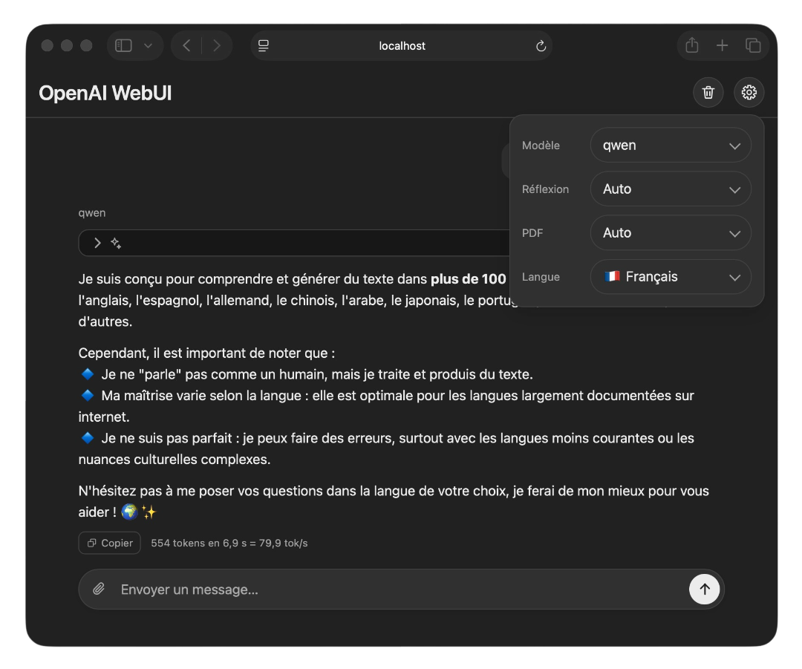

# OpenAI WebUI

A single web page, with no build step, covering the essentials of the ChatGPT interface: model selection, file attachments, streaming answers, Markdown and syntax highlighting, reasoning models, PDF reading in the browser, and twelve interface languages. NGinX serves the page and proxies the API, so the key stays server-side and never reaches the browser.

## Installation on a server

Two files are needed on the host, and nothing else — the image carries the site and the NGinX configuration.

`compose.yml`:

```yaml
services:

  openai-webui:
    image: 'casa/openai-webui:latest'
    ports:
      - '${PORT:-1111}:80'
    env_file: .env
    restart: unless-stopped
```

`.env`, beside it, holding the configuration (see below). Then:

```sh
docker compose up -d       # start
docker compose logs -f     # follow the logs
docker compose down        # stop
```

The interface is available at http://localhost:1111.

The configuration listens over plain HTTP and does not authenticate visitors: anyone who reaches the server spends your API quota. Reachable from the Internet, it needs TLS and access control in front of it.

## Configuration

Copy [.env.example](.env.example) to `.env` and fill it in. The file is required: without it Compose refuses to start.

| Variable | Description |
|---|---|
| `OPENAI_API_BASE_URL` | Base URL of the OpenAI-compatible API — `https://api.openai.com/v1/`, or `http://192.168.1.102:1234/v1/` for LM Studio or Ollama. A trailing slash is added if missing: it is what maps `/api/models` onto `/v1/models`. Unset, the container stops with an explicit message. |
| `OPENAI_API_KEY` | The key, without the `Bearer ` prefix. Left empty, no `Authorization` header is sent at all, which is what a local backend that does not authenticate expects. |
| `PORT` | Host port the interface is published on. Defaults to 1111. |

The variables are read on every container start, so a change needs a `docker compose up -d` but no rebuild.

## Interface



 **The bin** clears the conversation: the whole history goes, so the model loses the context and the next message starts from nothing — which is also how a long thread stops costing prompt tokens on every turn. Thinking and PDF go back to Auto with it. Reloading the page does the same, as nothing is stored anywhere.

 **The gear** opens the four settings below, the only configuration the page has. They sit behind a button because they are chosen once and then left alone.

**Model** lists what the backend offers, and is filled on load. The choice is remembered across reloads, unlike the three settings that follow, which start afresh every time.

**Thinking** on `Off` asks the model not to reason: a faster and cheaper answer, when the question can do without. On `Auto` the model decides, and its reasoning is shown in a panel above the answer, folded away once the answer proper begins. A backend that refuses the request is retried without the parameters, and the answer says so.

**PDF** decides how an attached document is sent, since most backends refuse the file itself. `Text` sends its text layer, `Image` its pages rendered as images — far more tokens, and a vision model needed, but a scanned document goes through. `Auto` takes the text and falls back to the images when there is none.

**Language** sets the language of the interface, twelve of them. It is guessed from the browser on the first visit, then remembered; the page is retranslated on the spot.

 **The paperclip** attaches files, several at a time and up to 20 MB each: images, text, source code, PDF, and anything else the model may accept. Each one becomes a chip above the field, saying what became of it and removable before sending.

**The field** sends on Enter and breaks the line on Shift+Enter, growing as the text does.

 **The arrow** sends the message too, and turns into a stop button  while the answer streams: what has been written by then is kept, and the metrics say the answer was interrupted.

 **The reasoning panel** appears above the answer when the model reasons, whether it says so in a field of its own or inlines its thoughts in the text. It scrolls along with the thinking, unless you scroll up to re-read something, and folds by itself the moment the answer starts — the chevron reopens it, and once reopened it stays that way.

**Answers** arrive as they are produced, in Markdown, code highlighted. Underneath, the metrics — tokens, time, rate — with the time to the first token and the prompt/completion breakdown a hover away.

 **The copy buttons** put the text on the clipboard rather than leaving you to select it. There is one under each answer, which copies the Markdown as the model wrote it, reasoning left out; one beside each of your own messages; and one on every code block, for the code alone, without the surrounding prose. Each says so briefly once clicked.

## Licence

[MIT](LICENSE). The bundled libraries — marked, highlight.js, DOMPurify, pdf.js — keep their original licence, recalled at the end of that file.
